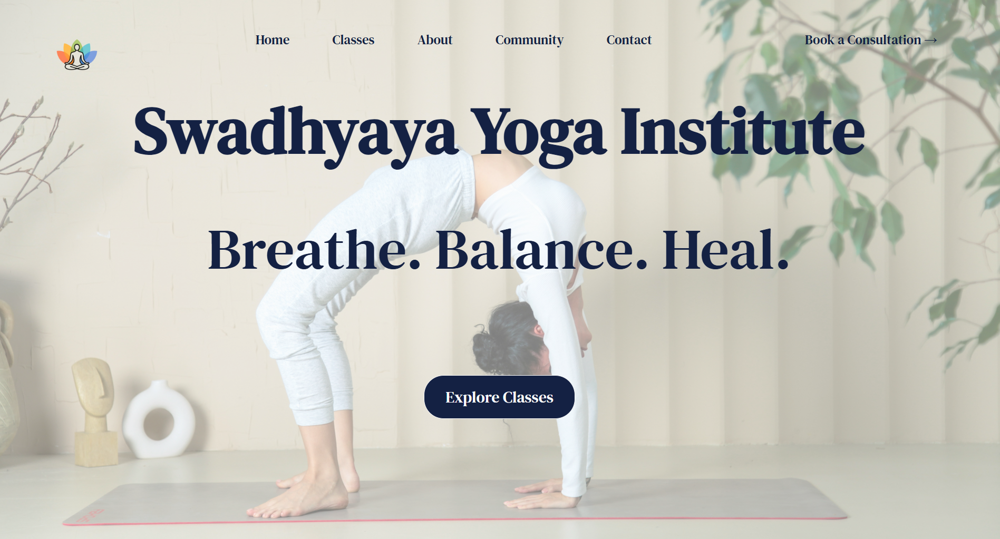
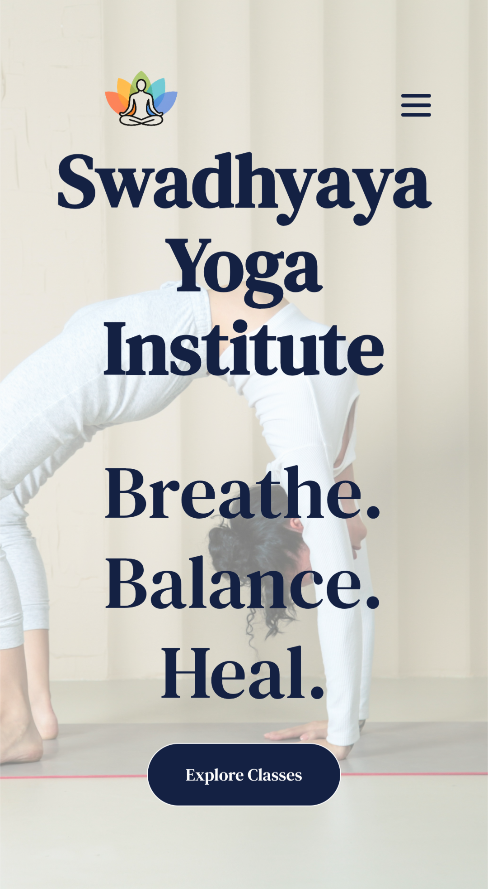

# Swadhyaya Yoga Institute – Website Case Study

🌐 **Live Site**: [https://swadhyayayoga.in](https://swadhyayayoga.in)

## Project Overview

Swadhyaya Yoga Institute is a traditional yoga studio in Bangalore (India), offering therapeutic yoga for seniors and people seeking holistic healing. The studio needed a professional and accessible online presence to share class information, build credibility, and enable easy contact and appointment booking.

## My Role

I worked independently on every aspect of the project, including:

- Branding & visual identity  
- Website design & development (HTML, CSS, JS)  
- Content writing  
- Logo design, Photography & image editing  
- Domain, DNS & SSL configuration  
- Third-party integrations

## Goals & Design Approach

The studio’s primary clientele includes:

- Seniors  
- People recovering from injury or seeking pain relief  
- Individuals seeking authentic, holistic yoga therapy  

With this in mind, I prioritized a clean, minimal, and calming UI that is intuitive for all age groups. Key actions like calling, booking, and finding the studio are always one click away.

### Hero Section

### Desktop

### Mobile

## Features & Integrations

- **Calendly** integration for class consultations  
- **WhatsApp API** for direct messaging  
- **HTML form** connected to **Google Sheets**  
- Click-to-call / click-to-email support  
- Embedded **Google Maps**  
- Social media links  
- **Free SSL via Cloudflare**, saving the client costs  
- Custom photos clicked and edited by me; stock photographs sourced from Unsplash & Pexels  
- Custom-written content to match the tone and values of the studio  
- Fully responsive across breakpoints

## Challenges & Solutions

### Hosting & DNS
The client was using GoDaddy, with incomplete setup. I handled the entire DNS integration, used Cloudflare for SSL, and ensured everything resolved securely.

### Responsiveness
I manually handled media queries and tested across devices to ensure mobile-first design for the target audience.

### One-Person Team
I managed all aspects—from design and content to technical setup and client communication. This gave me full creative control and also taught me how to manage scope effectively.

## Outcome

- Website is live and functional  
- Secure, fast, and mobile-friendly  
- Clear structure, user-friendly interface  
- Client outreach improved via direct contact tools

## Tools Used

- HTML5, CSS3, JavaScript + GSAP
- GoDaddy, Cloudflare
- Figma (for initial wireframing)
- Notion (for project planning)  
- Calendly, Google Forms, Google Sheets  
- Snapseed, Canva  
- Unsplash, Pexels

## Client Testimonial

_“We would like to express our appreciation for the website Manaswita developed for Swadhyaya Yoga Institute. The design is visually appealing and perfectly aligns with the calm, tranquil essence of yoga. The layout is intuitive and user-friendly, making it easy for visitors to navigate through sections and find class and resource information._

_The use of color and imagery creates a warm, inviting atmosphere, and the content is both engaging and informative — encouraging users to explore more. Overall, it's a thoughtfully crafted website that beautifully enhances the user experience.”_

— Raghavendra R, Founder of Swadhyaya Yoga Institute

**Note**: The source code for this project is not publicly available due to privacy and security considerations. This repository is intended to showcase the design, features, and development process through a case study.

